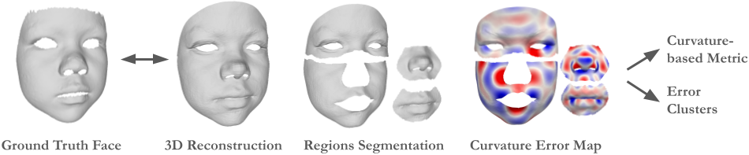

This repository contains the code and experiments accompanying our paper:

***"Discovering Geometric Biases in 3D Face Reconstruction: A Curvature-Aware Spectral Framework for Fairness Evaluation" (ECCV 2026)***

## Overview



This project provides a compact pipeline to:

- extract specific face regions (nose, mouth, cheek and forehead) from reconstructed 3D meshes,
- compute and compare mean-curvature maps between reconstruction and ground truth,
- project curvature-error maps into Laplace-Beltrami spectral basis,
- cluster reconstruction error patterns and inspect demographic correlations.

## Installation

1. **Clone the repository**

```bash
git clone git@github.com:artefactory/face-recon-fairness.git
cd face-recon-fairness
```

2. **Create and activate your virtual environment**

```bash
python3 -m venv .venv
source .venv/bin/activate
```

3. **Install dependencies**

```bash
pip install -r requirements.txt
```

## Data Preparation

1. In order to use our evaluation pipeline, you need an access to REALY benchmark. Please sign the [Agreement](https://www-users.york.ac.uk/~np7/research/Headspace/) and indicate the usage of REALY benchmark according to their guideline, then you will get the permission to download the data.

2. Unzip the benchmark file and put "REALY_scan_region/", "REALY_image/" and "REALY_HIFI3D_keypoints/" folders into "data/REALY".

3. Use the images in the "REALY_image/" folder to reconstruct 3D meshes with your method(s) and put them into "data/" folder. 

## Quick Usage

Here is a short example of how to calculate curvature-based error maps @nose and cluster them in Laplace-Beltrami spectral space.

```python
from utils.curvature_calculation import calculate_curvature_maps
from utils.spectral_clustering import (
    calculate_spectral_decomposition,
    cluster_curvature_maps,
)

# Compute curvature maps for a given face region
H_gt, H_rec, H_diff = calculate_curvature_maps(
    face_region="nose",
    template_name='basel', # 3DMM template that was used for reconstruction
    reconstruction_data_path=reconstruction_data_path, # path to 3D meshes reconstructed with your method
    save_path=save_path,
    n_neighbors=3,
    curvature_plot_save=False,
)

# Spectral decomposition
spectral_coefs, evecs = calculate_spectral_decomposition(
    diff_error_maps=H_diff,
    face_region="nose",
    template_name='basel',
    n_eig=512,
    reconstruction_data_path=reconstruction_data_path,
    save_path=save_path,
)

# Spectral clustering
labels = cluster_curvature_maps(
    diff_curvature_maps=H_diff,
    spectral_coefs=spectral_coefs,
    evecs=evecs,
    face_region="nose",
    template_name='basel',
    reconstruction_data_path=reconstruction_data_path,
    save_path=save_path,
)
```

* Ground truth and reconstruction mean curvature maps, differences between them and the respective error cluster labels will be saved to "<save_path>" folder.

* \[Optional\] If you put "curvature_plot_save=True", plots of ground truth and reconstruction mean curvature maps and differences between them will be saved to "<save_path>/plots" for a given face region.
